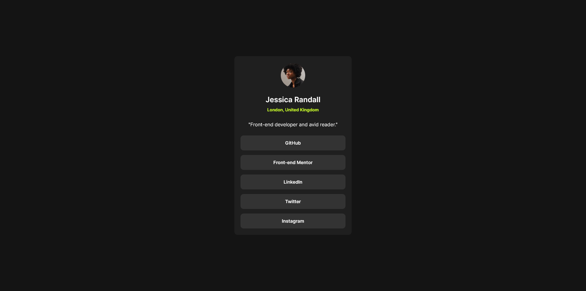

# Frontend Mentor - Social links profile solution

This is a solution to the [Social links profile challenge on Frontend Mentor](https://www.frontendmentor.io/challenges/social-links-profile-UG32l9m6dQ). Frontend Mentor challenges help you improve your coding skills by building realistic projects. 

## Table of contents

- [Overview](#overview)
  - [The challenge](#the-challenge)
  - [Screenshot](#screenshot)
  - [Links](#links)
- [My process](#my-process)
  - [Built with](#built-with)
  - [What I learned](#what-i-learned)
  - [Continued development](#continued-development)
  - [Useful resources](#useful-resources)
  - [AI Collaboration](#ai-collaboration)
- [Author](#author)
- [Acknowledgments](#acknowledgments)


## Overview

### The challenge

Users should be able to:

- See hover and focus states for all interactive elements on the page

### Screenshot




### Links

- Solution URL: (https://github.com/Imnot343guiltyspark/Front-end-Mentor-linktree)
- Live Site URL: (https://imnot343guiltyspark.github.io/Front-end-Mentor-linktree/)

## My process

For this project, I started by addressing gaps from my previous project, like using `rem` instead of `px` and building with a mobile-first mindset as a best practice throughout.

That approach is exactly what helped me really understand the relationship between `width: 100%` and `max-width`. When you start building for a smaller screen size, it guides you to keep things no bigger than they need to be, and `width: 100%` seems perfect for that. But once you tackle responsiveness and scale things up, you realize `width: 100%` is literal — it keeps growing without stopping. So you need to set a ceiling, and that's where `max-width` comes in. Without it, the element would grow to the full width of the screen and the final design would break.

This project made me realize I had a lot of gaps to work on, which I'll keep focusing on in my upcoming projects.

### Built with

- Semantic HTML5 markup
- CSS custom properties
- Flexbox
- Mobile-first workflow

### What I learned

The biggest lesson from this project was learning to zero out the browser's default spacing, since every browser adds its own default margins and padding that can throw off your whole layout. The best approach is adding a global reset that sets `margin` and `padding` to `0` from the start, so you avoid running into these issues later. Going forward, this is something I'll keep implementing in every project.

To see how you can add code snippets, see below:

```html
<ul class="list-order">
          <li class="list-order__links"><a href="#">GitHub</a></li>
          <li class="list-order__links"><a href="#">Front-end Mentor</a></li>
          <li class="list-order__links"><a href="#">LinkedIn</a></li>
          <li class="list-order__links"><a href="#">Twitter</a></li>
          <li class="list-order__links"><a href="#">Instagram</a></li>
        </ul>
```
```css
.linktree {
  display: flex;
  flex-direction: column;
  align-items: center;
  background-color: var(--grey-800);
  padding: 1.8rem 2rem .5rem 2rem;
  border-radius: 1rem;
  text-align: center;
  width: 100%;
  max-width: 38.4rem;
  margin: 0 2rem;
}
```


### AI Collaboration

I did use Claude as a former teacher, always telling me and teaching me the ways to do it not giving me a single line of code just pure iteration all by my self.

There was a bit of misunderstanding but that helped me to realize that I knew the answer and that's how now I'm shaping my criteria.

## Author

- Frontend Mentor - [@Imnot343guiltyspark](https://www.frontendmentor.io/profile/Imnot343guiltyspark)
